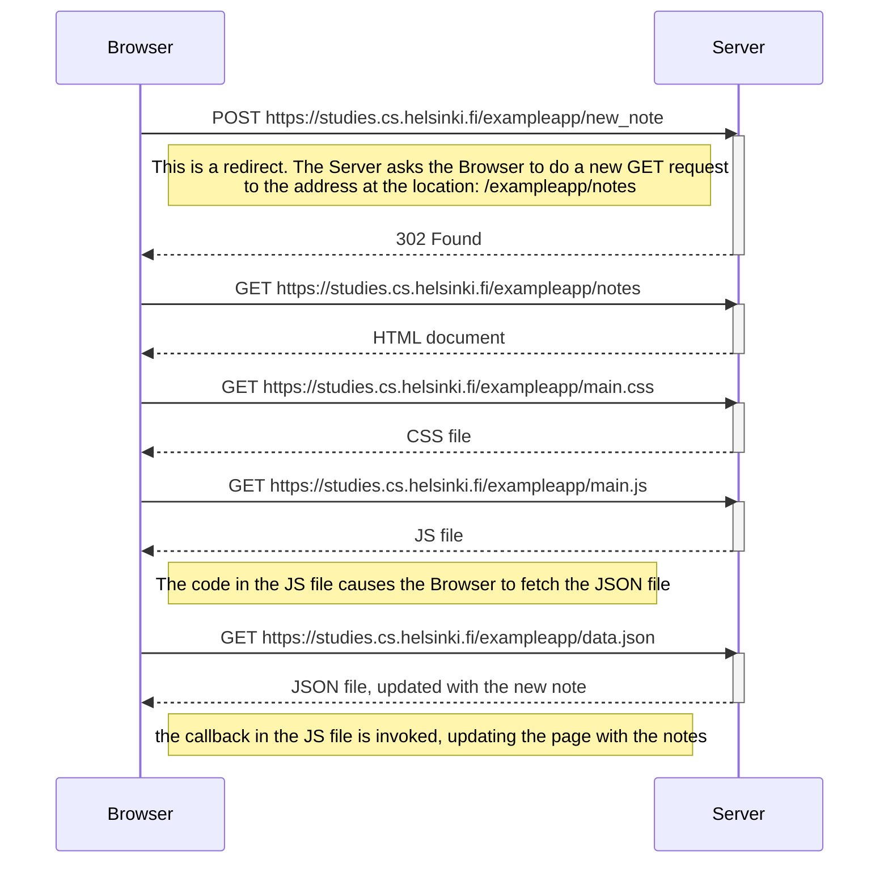

```mermaid
sequenceDiagram
participant Browser
participant Server
Browser ->> Server: POST https://studies.cs.helsinki.fi/exampleapp/new_note
activate Server
Note left of Server: This is a redirect. The Server asks the Browser to do a new GET request<br>to the address at the location: /exampleapp/notes 
Server -->> Browser: 302 Found
deactivate Server
Browser ->> Server: GET https://studies.cs.helsinki.fi/exampleapp/notes
activate Server
Server -->> Browser: HTML document
deactivate Server
Browser ->> Server: GET https://studies.cs.helsinki.fi/exampleapp/main.css
activate Server
Server -->> Browser: CSS file
deactivate Server
Browser ->> Server: GET https://studies.cs.helsinki.fi/exampleapp/main.js
activate Server
Server -->> Browser: JS file
deactivate Server
Note right of Browser: The code in the JS file causes the Browser to fetch the JSON file
Browser ->> Server: GET https://studies.cs.helsinki.fi/exampleapp/data.json
activate Server
Server -->> Browser: JSON file, updated with the new note
deactivate Server
Note right of Browser: the callback in the JS file is invoked, updating the page with the notes
```
