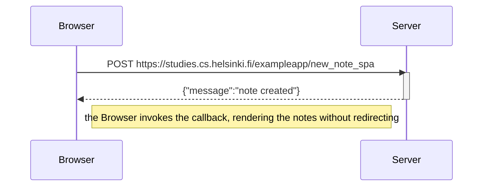

```mermaid
sequenceDiagram
participant Browser
participant Server
Browser ->> Server: POST https://studies.cs.helsinki.fi/exampleapp/new_note_spa
activate Server
Server -->> Browser: {"message":"note created"}
deactivate Server
Note right of Browser: the Browser invokes the callback, rendering the notes without redirecting
```
