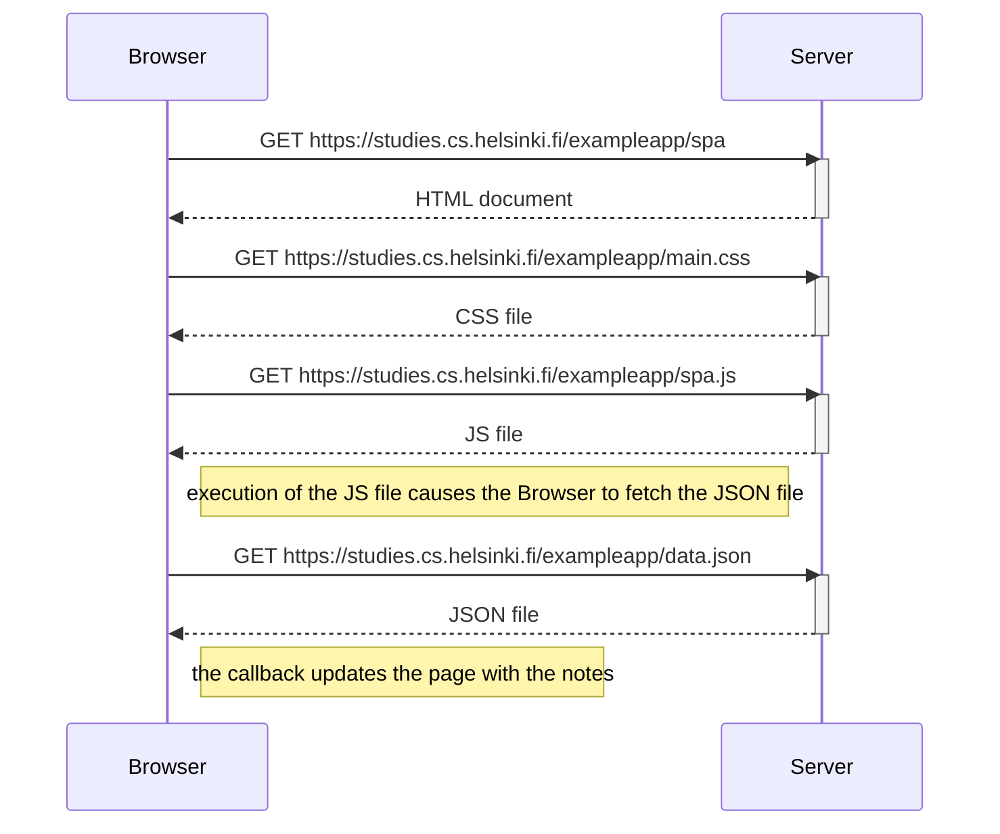

```mermaid
sequenceDiagram
participant Browser
participant Server
Browser ->> Server: GET https://studies.cs.helsinki.fi/exampleapp/spa
activate Server
Server -->> Browser: HTML document
deactivate Server
Browser ->> Server: GET https://studies.cs.helsinki.fi/exampleapp/main.css
activate Server
Server -->> Browser: CSS file
deactivate Server
Browser ->> Server: GET https://studies.cs.helsinki.fi/exampleapp/spa.js
activate Server
Server -->> Browser: JS file
deactivate Server
Note right of Browser: execution of the JS file causes the Browser to fetch the JSON file
Browser ->> Server: GET https://studies.cs.helsinki.fi/exampleapp/data.json
activate Server
Server -->> Browser: JSON file
deactivate Server
Note right of Browser: the callback updates the page with the notes
```
